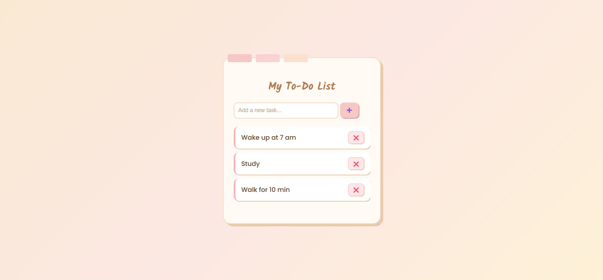

# My To-Do List
A minimal to-do app with a soft paper-note design. Built using HTML, CSS, and JavaScript it lets you add and delete tasks effortlessly while keeping a calm and beautiful interface. Perfect for everyday planning with style.

## 🚀 Features
- ➕ Add new tasks easily   
- ❌ Delete tasks with a button  
- 🌈 Easily themeable CSS (multiple aesthetic skins possible)
- 🎨 Responsive & minimal UI  

---

## 📸 Preview
  
  

---

## 🛠 Tech Stack
- **HTML** — markup
- **CSS** — styles (Aesthetic Paper-Note theme)
- **JavaScript** — simple DOM interactions

---
## 📂 Project Structure
*📂My To-Do List*    
│   
├── *📂index.html*  
├── *📂style.css*    
├── *📂app.js*  
├── *📂p1.png*     
├── *📂p2.png*      
└── *📂README.md*   

## 🌟 Future Improvements
- 🌓 Add Dark Mode toggle

- 💾 Save tasks in Local Storage

- 📱 Improve mobile responsiveness

## 📜 License

-This project is open-source and free to use for learning & practice.

## Made with ❤ by Arunima Satpathy
